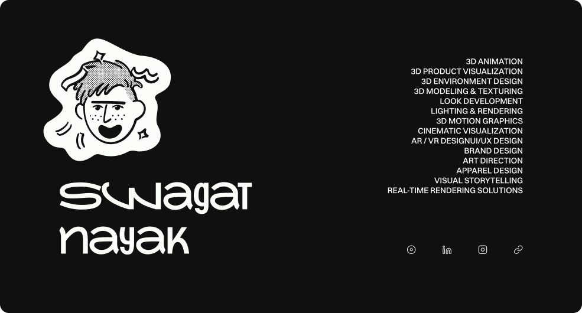

<picture>
  <source media="(prefers-color-scheme: dark)" srcset="light.svg">
  <source media="(prefers-color-scheme: light)" srcset="dark.svg">
  
</picture>

Swagat Nayak, also carrot. Product designer in Dehradun, India.

I design interfaces that move. Six years of 3D and YouTube taught me timing - now it goes into products.

Everything on my site is handcrafted.

## Look around

- [beingcarrot.com](https://beingcarrot.com) - the whole thing
- [Product work](https://beingcarrot.com/designed) - case studies with the process and the decisions. [Reker](https://beingcarrot.com/designed/reker), [wingball](https://beingcarrot.com/designed/wingball), [Zenith](https://beingcarrot.com/designed/zenith) and [Landeed](https://beingcarrot.com/designed/landeed) are good places to start
- [Craft](https://beingcarrot.com/craft) - 3D renders, YouTube work and thumbnails
- [Lab](https://beingcarrot.com/lab) - a motion tool, a colour tool and two LED games

## Elsewhere

- LinkedIn - [in/swaaagat](https://www.linkedin.com/in/swaaagat/)
- X - [@beingcarrot](https://x.com/beingcarrot)
- Instagram - [@carrotbeingcarrot](https://www.instagram.com/carrotbeingcarrot)
- YouTube - [@carrotbeingcarrot](https://www.youtube.com/@carrotbeingcarrot) - I live stream sometimes. Come join me there :D

## Say hi

The [contact page](https://beingcarrot.com/contact) has a short form and every direct line.

## The site

Astro 7, React islands, Tailwind v4 and motion.dev, on Cloudflare Workers. Content is MDX in Git.
